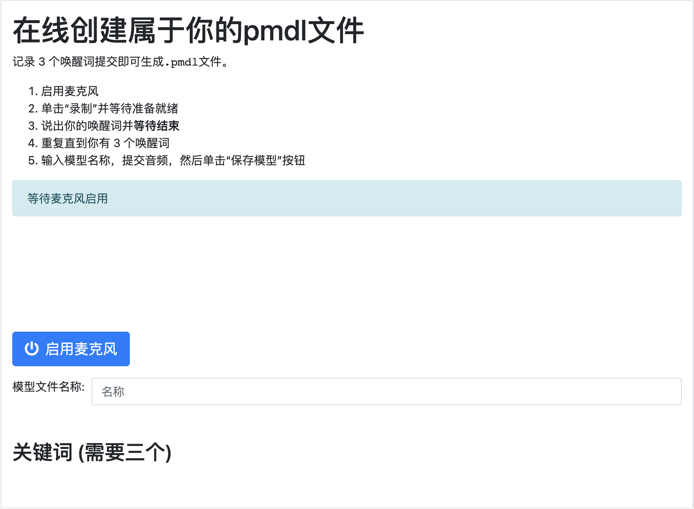

# 在线snowboy模型生成器

本项目基于snowboy-seasalt进行翻译 [源链接](https://github.com/rhasspy/snowboy-seasalt/)。

基于 Docker 的 Web 界面，用于`.pmdl`从 [snowboy](https://github.com/Kitt-AI/snowboy) 的音频示例生成文件。

感谢 [seasalt-ai](https://github.com/seasalt-ai/snowboy)

## Docker 镜像

首先，运行预先构建的 Docker 镜像：

```sh
$ docker run -it -p 8000:8000 james18178/snowboy-seasalt-chinese
```

现在可以在http://localhost:8000访问 Web 界面

如果您想自己构建 Docker 映像，请参阅 `scripts/build-docker.sh`

## 网页界面

可以直接在 Web 浏览器中记录和提交示例。启用麦克风后（Chrome 需要），每个示例都可以通过以下方式录制：

1. 单击“录制”按钮并等待它准备就绪
2. 说出唤醒词，然后静静地等待它完成

这里的时间限制用于避免需要从音频中修剪按钮点击。

获得 3 个关键词后，单击“提交”，您应该会看到一个“保存模型”按钮。将`.pmdl`文件保存在某处并享受您的新唤醒词！



Audio visualization is provided by [wavesurfer-js](https://wavesurfer-js.org/)

## HTTP API

You can also `POST` your audio examples to the web server directly and get a `.pmdl` file back!

The `/generate` endpoint expects form data with:

* A `modelName` field with your wake word name
* At least 3 files with audio samples
    * These will be converted to the appropriate format with `ffmpeg`
    * Unless `?noTrim=true` is given, silence is automatically trimmed from the beginning and end of each example

```sh
$ curl \
    -X POST \
    -F modelName=okay-rhasspy \
    -F example1=@example1.wav \
    -F example2=@example2.wav \
    -F example3=@example3.wav \
    --output okay-rhasspy.pmdl \
    localhost:8000/generate
```
